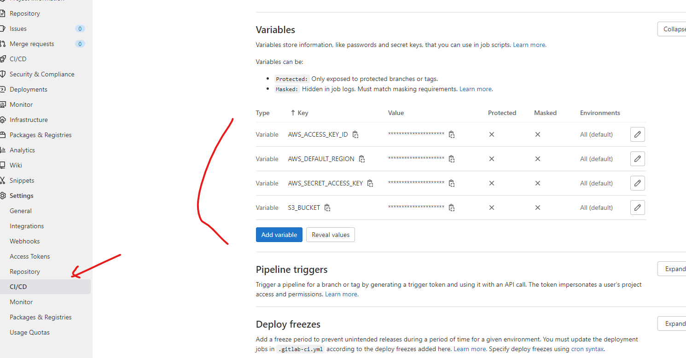

# Delivery for a three-tier Node application in the cloud

You want to design a continuous delivery architecture for a scalable and secure 3 tier Node application.

Application to use can be found on [https://git.toptal.com/rjrpaz/node-3tier-app2](https://git.toptal.com/rjrpaz/node-3tier-app2).

## Requirements

The requirements for the test project are:

- Both web and API tiers should be exposed to the internet and DB tier should not be accessible from the internet.

- You should clone the repository and use it as the base for your system.

- You need to create resources for all the tiers.

- The architecture should be completely provisioned via some infrastructure as a code tool.

- Presented solution must handle server (instance) failures.

- Components must be updated without downtime in service.

- The deployment of new code should be completely automated (bonus points if you create tests and include them into the pipeline).

- The database and any mutable storage need to be backed up at least daily.

- All relevant logs for all tiers need to be easily accessible (having them on the hosts is not an option).

- You should clone the repository and use it as the base for your system.

- You should be able to deploy it on one larger Cloud provider: AWS / Google Cloud / Azure / DigitalOcean / RackSpace.

- The system should present relevant historical metrics to spot and debug bottlenecks.

- The system should implement CDN to allow content distribution based on client location

As a solution, please commit to the Toptal git repo the following:

- An architectural diagram / PPT to explain your architecture during the interview.

- All the relevant configuration scripts (Terraform/Ansible/Cloud Formation/ARM Templates)

- All the relevant runtime handling scripts (start/stop/scale nodes).

- All the relevant backup scripts.

- You can use another git provider to leverage hooks, CI/CD or other features not enabled in Toptal’s git. Everything else, including the code for the CI/CD pipeline, must be pushed to Toptal’s git.

## Infrastructure design


This architecture includes:

- A single VPC with an Internet Gateway.
- 2 availability zones are used (minimun value required for ALB).
- 2 ALB deployed across 2 AZs in the public subnets.
  - One for the frontend EC2 ASG
  - One for the backend EC2 ASG.
- Each EC2 ASG spans across 2 AZs.
- frontend talks to backend via this ALB.
- Data tier is stored using RDS (postgres). RDS uses multi AZ setup so we have a standby instance in the second AZ.
- Each Tier is secured by a security group that restricts traffic to the tier above.
  - The data tier’s security group only allows inbound traffic from the backend tier’s security group.
  - The backend tier’s security group allows inbound from its ALB.
  - The backend ALB’s security group allows outbound only to the backend tier’s security group and allows inbound from anywhere but only on specific ports (80 and 8081)
  - The frontend tier’s security group allows outbound only to the backend ALB’s security group and allows inbound only from the frontend ALB.
  - The frontend ALB allows inbound from anywhere but only on specific ports (80 and 8080).

## Building the infrastructure for the app

I'm going to use *AWS* as cloud provider. AWS region to be used is *us-east-1*.

I'm going to use *terraform* to create the infrastructure for the app. In case you need to install terraform, you can check [here](https://learn.hashicorp.com/tutorials/terraform/install-cli).

Main steps are:

1. Create AWS credentials
2. Create S3 bucket to store terraform state
3. Create infrastructure using terraform

### Create AWS credentials

You should request API credentials for an IAM user with enough privileges to do required actions in AWS:

- create/destroy EC2 instances
- read/write access to the S3 bucket
- create/destroy networking objects (VPC, routes)
- create/destroy load balancers

Check [here](https://docs.aws.amazon.com/sdk-for-javascript/v2/developer-guide/getting-your-credentials.html) about how to create the credentials.

### Create S3 bucket to store terraform state

Terraform state is stored in an s3 bucket. You can create this bucket using AWS credentials and *aws cli* tool.

In case you need to install *aws cli*, you can check [here](https://docs.aws.amazon.com/cli/latest/userguide/getting-started-install.html).

Export AWS credentials to be used by the cli and by terraform:

```bash
export AWS_ACCESS_KEY_ID="<replace_with_key_value>"
export AWS_SECRET_ACCESS_KEY="<replace_with_secret_value>"
```

I will save the terraform state in a bucket named *tt-rjrpaz-tf*. Choose a proper name yourself and create the bucket:

```bash
aws s3api create-bucket --bucket tt-rjrpaz-tf --region us-east-1
```

the command will return something like this:

```bash
{
    "Location": "/tt-rjrpaz-tf"
}
```

### Create infrastructure using terraform

Change to directory [infra]([./infra]):

```bash
cd infra
```

Update file *backends.tf* and define the name of the s3 bucket created in previous step. It should look like this:

```console
$ cat backends.tf
terraform {
  backend "s3" {
    # Replace this with your bucket name
    bucket         = "tt-rjrpaz-tf"
    key            = "infra"
    region         = "us-east-1"
  }
}
```

Create file *terraform.tfvars* and configure sensitive names required by terraform. You can use terraform.tfvars.sample as an example:

```console
$ cat terraform.tfvars.sample

create_bastion   = true
access_ip        = "0.0.0.0/0"
dbname           = "devops"
dbuser           = "dbuser"
dbpassword       = "<put_pass_here>"
gitlab_token     = "<put_gitlab_token_here>"
private_key_path = "/home/myuser/.ssh/id_rsa"

```

- *create_bastion*: boolean, indicates if a bastion host should be created (this is mainly required for debug purposes).
- *access_ip*: CIDR of the management network. If you want to restrict access to the service, change this value.
- *dbname*: name of the postgres database.
- *dbuser*: database user.
- *dbpassword*: database user password.
- *gitlab_token*: token to authenticate to gitlab repository.
- *private_key_path*: private SSH key to access login to the instances (this is mainly required for debug purposes).

Some other non-sensitive variables are defined in file *variables.tf* (AWS region, p.e.). Take a look to the file and do any required modification.

Initialize terraform:

```bash
terraform init
```

Check modifications to be done before apply them:

```bash
terraform plan
```

Create the infrastructer:

```bash
terraform apply
```

This will take a few minutes. Command output should be showing something like this:

```console

   ...

backend_endpoint = "tt-loadbalancer-back-1560565900.us-east-1.elb.amazonaws.com"
frontend_endpoint = "tt-loadbalancer-front-1992000051.us-east-1.elb.amazonaws.com"
rds_endpoint = "tt-db.cmjc5qdthd3j.us-east-1.rds.amazonaws.com:5432"
```

### Testing infrastructure

Both web and API tiers are exposed to the internet. DB tier however is not.

The EC2 instances take a few more minutes to start the server and the application.

Open a browser and point to the frontend_endpoint url (this will differ each time):

```http://tt-loadbalancer-front-1992000051.us-east-1.elb.amazonaws.com```

You can also access to the API url. Point to the following url:

```http://tt-loadbalancer-back-1560565900.us-east-1.elb.amazonaws.com/api/status```

### Description of the code

Terraform includes 4 modules to create main resource types:

- networking
- database
- loadbalancing
- compute

As usual in terraform, *main.tf* call the modules and creates the resources.

Terraform creates all required resources except for the S3 bucket used to store terraform state, which was created using the *s3 cli* tool.

### High availability and redundancy

EC2 instances are created as part of an Autoscaling group. Terraform creates the autoscaling group, not the instances directly. This means that terraform has no knowledge about the created EC2 instances, being this managed by the autoscaling group and the cloud provider.

Being part of an autoscaling group means that if there is a server failure, the autoscale group is going to replace it with a new healthy instances. It also means that number of instances can scale up and down.

Also services are provided through a load balancer. A LB works tighly with the autoscale group. When an instance goes down, the load balancer redirects the traffic to the healthy instances so there should be no downtime in the service.

## CI/CD pipeline

I'm going to use Gitlab CI/CD for the pipeline. Gitlab requires the installation of *gitlab runner* in the working development station.

I'm using an Ubuntu-based station. Check [here](https://docs.gitlab.com/runner/install/linux-manually.html) to learn more about how to install gitlab-runner.

Gitlab-runner also requires a running version of docker.

Once gitlab runner is installed in the server, it will run as a local service. Then we need to register this service to the remote repository. Check *Settings* -> *CI/CD* -> *Runners* to learn about how to register this service.

The file that defined the pipeline is part of the project: [https://git.toptal.com/rjrpaz/node-3tier-app2/-/blob/master/.gitlab-ci.yml](https://git.toptal.com/rjrpaz/node-3tier-app2/-/blob/master/.gitlab-ci.yml)

I defined three main stages for the pipeline:

- build: it will build the application
- test: it will run tests (if any - TBD)
- deploy: it will deploy the services

The last stage is only applied on the master branch.

Regarding the fact that the infrastructure where this application is running install the application from scratch (downloading the code from the gitlab repository), then the new deployement can be achivieved just by renewing the autoscaling group with new fresh instances. The deploy stage run a command to do this renewal then.

To able to run aws command in the CI/CD we should use a predefined image that includes the aws command. It also requires to configure some environment variables in the pipeline that allows aws command to run with no errorr (aws credencials, p.e.)



This approach is mostly used when we deal with a kubernetes-based infrastrcture instead of using instances, so it can be improved a lot. Being the first time that I use gitlab CI/CD, I preferred to be conservative. An artifact approach to be downloaded by an agent in the EC2 instance may be an improvement in this case. For this, an s3 bucket can be used to store the artifacts.

Once the project is modified and merge to master, the pipeline runs all steps:


After the instance group renewal, we can see the new version of the app:


<!-- The requirements for the test project are:

- ADD TESTS TO THE PIPELINE

- The database and any mutable storage need to be backed up at least daily.

- All relevant logs for all tiers need to be easily accessible (having them on the hosts is not an option).

- The system should present relevant historical metrics to spot and debug bottlenecks.

- The system should implement CDN to allow content distribution based on client location

As a solution, please commit to the Toptal git repo the following:

- All the relevant configuration scripts (Terraform/Ansible/Cloud Formation/ARM Templates)

- All the relevant runtime handling scripts (start/stop/scale nodes).

- All the relevant backup scripts.

- You can use another git provider to leverage hooks, CI/CD or other features not enabled in Toptal’s git. Everything else, including the code for the CI/CD pipeline, must be pushed to Toptal’s git. -->

## Improvements

The pipeline should be able to identify if the modifications for the project impact frontend or backend only and proceed to do the update to the specific autoscaling group.

Add a testing stage for the infrastructure management itseft through *terramake*.

Add redudancy to the database. Both subnets are already created. A master is created in the first subnet but the replica is missing in the second subnet. Also, an internal load balancer should be added as an endpoint for both databases (?).

Add proper DNS entries for both services.

Renew the application instead of the server when a new release is merged in master.

Create an artifact to be downloaded when a new Instance is created, instead of using the git clone approach.
